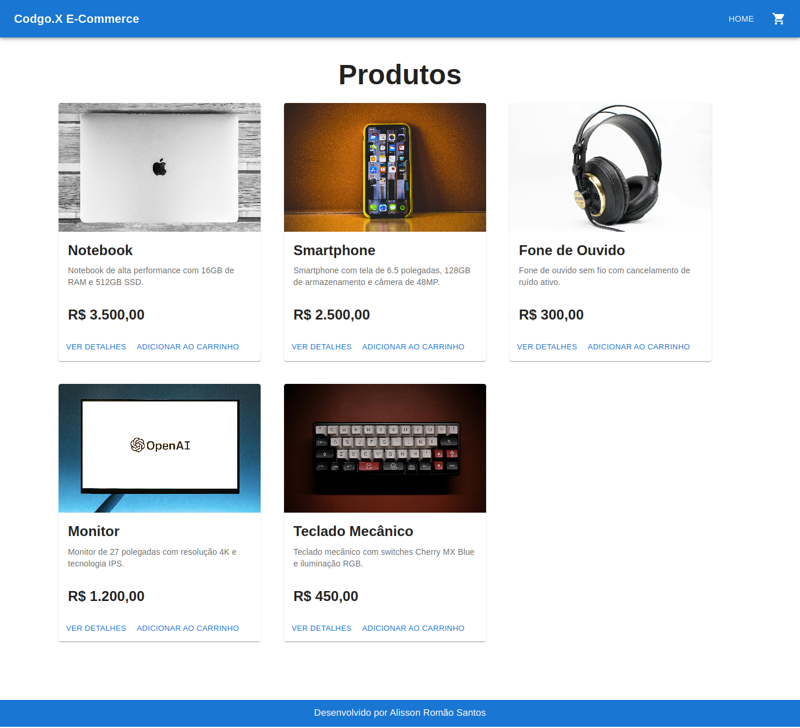
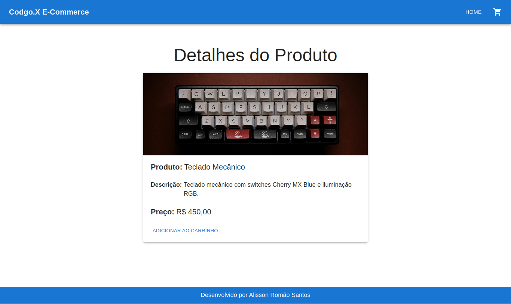
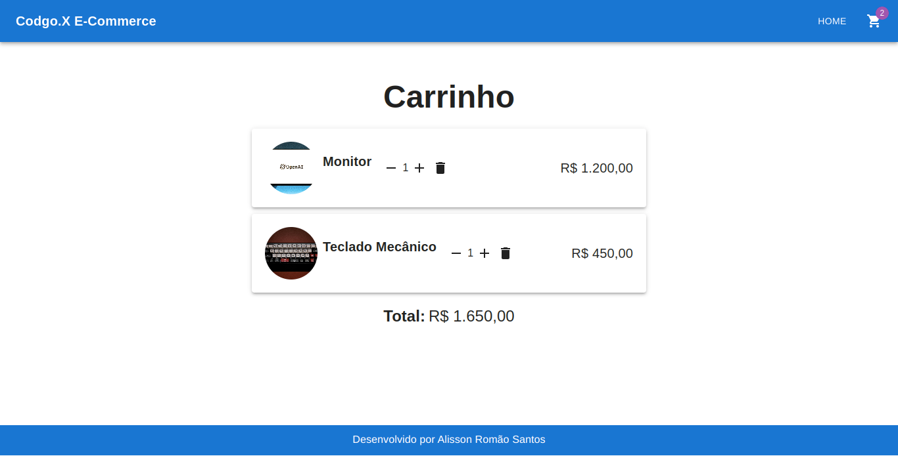

# Codgo.X E-Commerce

## Descrição
Codgo.X E-Commerce é um projeto de um e-commerce simples com funcionalidade de carrinho de compras.

## Funcionalidades
- **Listar produtos**: Exibe todos os produtos disponíveis na loja.
- **Ver detalhes de um produto**: Exibe informações detalhadas sobre um produto específico.
- **Adicionar produto ao carrinho**: Permite adicionar produtos ao carrinho de compras.
- **Remover produto do carrinho**: Permite remover produtos do carrinho de compras.
- **Atualizar quantidade de produtos no carrinho**: Permite alterar a quantidade de produtos no carrinho.
- **Calcular total de produtos no carrinho**: Calcula o valor total dos produtos no carrinho.

## Instalação
Para instalar e executar o projeto localmente, siga os passos abaixo:

1. Certifique-se de ter o Node.js instalado.
2. Clone o repositório para sua máquina:
```sh
git clone https://github.com/seu-usuario/codgo-x-ecommerce.git
```
3. Navegue até o diretório do projeto:
```sh
cd codgo-x-ecommerce
```
4. Abra a pasta no VSCode:
```sh
code .
```
5. Instale as dependências:
```sh
npm install
```
6. Execute o projeto:
```sh
npm run dev
```

## Uso
- **Página Home**: Exibe todos os produtos disponíveis.
- **Ver detalhes**: Clique no botão "Ver detalhes" para visualizar as especificações de um produto.
- **Adicionar ao carrinho**: Adicione um produto ao carrinho clicando no botão "Adicionar ao carrinho" na página Home ou na página de detalhes do produto.
- **Visualizar carrinho**: Para ver o carrinho, clique no ícone do carrinho de compras no menu, que o direcionará para a página do carrinho.

## Layout
Aqui estão algumas capturas de tela do layout do Codgo.X E-Commerce:







## Contribuição
Alisson Romão Santos

## Licença
Este projeto está licenciado sob a Licença MIT - veja o arquivo [LICENSE](LICENSE) para mais detalhes.

## Autores
- **Alisson Romão Santos**

## Outras Informações
Sinta-se à vontade para contribuir com o projeto, submetendo pull requests ou abrindo issues para relatar bugs ou sugerir melhorias.